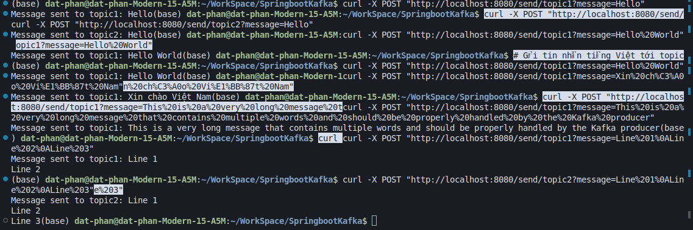

# Spring Boot Kafka Demo

This project demonstrates a simple implementation of Apache Kafka with Spring Boot, showing how to produce and consume messages using multiple topics.

## Technologies Used

- Java 21
- Spring Boot 3.4.4
- Apache Kafka
- Maven

## Prerequisites

- Java 21 or higher
- Maven
- Apache Kafka running locally (default port: 9092)
- Spring Boot application

## Project Structure

```
src/main/java/com/example/kafkademo/
├── KafkaDemoApplication.java
├── KafkaController.java
├── KafkaProducer.java
├── KafkaConsumer1.java
└── KafkaConsumer2.java
```

## Configuration

The application is configured with the following Kafka settings in `application.properties`:

```properties
# Kafka broker
spring.kafka.bootstrap-servers=localhost:9092

# Producer config
spring.kafka.producer.key-serializer=org.apache.kafka.common.serialization.StringSerializer
spring.kafka.producer.value-serializer=org.apache.kafka.common.serialization.StringSerializer

# Consumer config
spring.kafka.consumer.group-id=group1
spring.kafka.consumer.auto-offset-reset=earliest
spring.kafka.consumer.key-deserializer=org.apache.kafka.common.serialization.StringDeserializer
spring.kafka.consumer.value-deserializer=org.apache.kafka.common.serialization.StringDeserializer
```

## Getting Started

1. Start your Kafka server
2. Run the Spring Boot application:
   ```bash
   mvn spring-boot:run
   ```

## API Endpoints

The application provides two endpoints for sending messages:

1. Send message to topic1:
   ```bash
   curl -X POST "http://localhost:8080/send/topic1?message=Hello%20World"
   ```

2. Send message to topic2:
   ```bash
   curl -X POST "http://localhost:8080/send/topic2?message=Hello%20World"
   ```

## Testing Examples

### Basic Messages
```bash
# Send to topic1
curl -X POST "http://localhost:8080/send/topic1?message=Hello"

# Send to topic2
curl -X POST "http://localhost:8080/send/topic2?message=Hello"
```

### Messages with Spaces
```bash
# Send to topic1
curl -X POST "http://localhost:8080/send/topic1?message=Hello%20World"

# Send to topic2
curl -X POST "http://localhost:8080/send/topic2?message=Hello%20World"
```

### Vietnamese Messages
```bash
# Send to topic1
curl -X POST "http://localhost:8080/send/topic1?message=Xin%20ch%C3%A0o%20Vi%E1%BB%87t%20Nam"

# Send to topic2
curl -X POST "http://localhost:8080/send/topic2?message=Xin%20ch%C3%A0o%20Vi%E1%BB%87t%20Nam"
```

### Multi-line Messages
```bash
# Send to topic1
curl -X POST "http://localhost:8080/send/topic1?message=Line%201%0ALine%202%0ALine%203"

# Send to topic2
curl -X POST "http://localhost:8080/send/topic2?message=Line%201%0ALine%202%0ALine%203"
```

## Demo Screenshot



## How It Works

1. The `KafkaController` receives HTTP POST requests with messages
2. The `KafkaProducer` sends these messages to the specified Kafka topics
3. `KafkaConsumer1` and `KafkaConsumer2` listen to their respective topics and process the messages
4. Messages are logged to the console when received by the consumers

## Contributing

Feel free to submit issues and enhancement requests.

## License

This project is licensed under the MIT License - see the LICENSE file for details.
