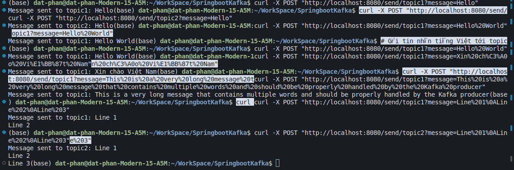
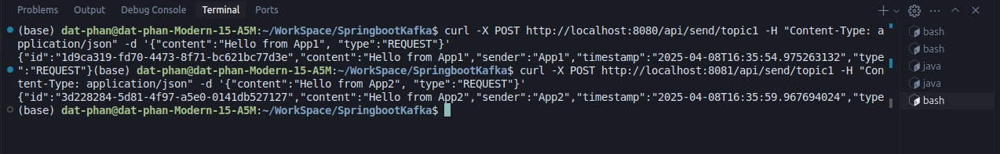
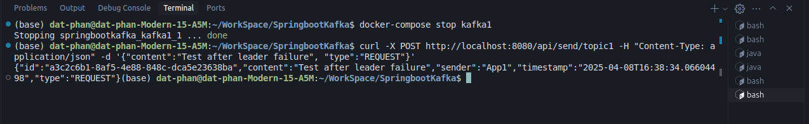
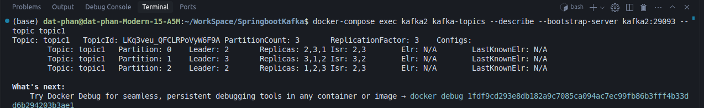

# Spring Boot Kafka Cluster Demo

This project demonstrates a distributed system using Spring Boot and Apache Kafka, featuring:
- Two Spring Boot applications exchanging JSON messages via Kafka
- A Kafka cluster with 3 nodes for high availability
- Automatic failover testing when a leader node goes down

## Architecture


The system consists of:
1. Two Spring Boot applications:
   - App1 (Port 8080): Producer and Consumer for topic1
   - App2 (Port 8081): Producer and Consumer for topic2
2. Kafka Cluster with 3 nodes:
   - kafka1 (Port 9092)
   - kafka2 (Port 9093)
   - kafka3 (Port 9094)
3. Zookeeper for cluster coordination

## Technologies Used

- Java 21
- Spring Boot 3.4.4
- Apache Kafka
- Docker & Docker Compose
- Maven

## Prerequisites

- Java 21 or higher
- Maven
- Docker & Docker Compose
- Git

## Project Structure

```
.
├── src/                           # App1 source code
│   └── main/
│       ├── java/
│       │   └── com/example/kafkademo/
│       │       ├── KafkaDemoApplication.java
│       │       ├── KafkaController.java
│       │       ├── KafkaProducer.java
│       │       ├── KafkaConsumer1.java
│       │       └── KafkaConsumer2.java
│       └── resources/
│           └── application.properties
├── app2/                          # App2 source code
│   └── src/
│       └── main/
│           ├── java/
│           │   └── com/example/kafkademo2/
│           │       ├── KafkaDemo2Application.java
│           │       ├── KafkaController2.java
│           │       ├── KafkaProducer2.java
│           │       └── KafkaConsumer2.java
│           └── resources/
│               └── application.properties
└── docker-compose.yml            # Kafka cluster configuration
```

## Getting Started

1. Clone the repository:
   ```bash
   git clone <repository-url>
   cd springboot-kafka-demo
   ```

2. Start the Kafka cluster:
   ```bash
   docker-compose up -d
   ```

3. Verify the cluster status:
   ```bash
   docker-compose ps
   ```

4. Create Kafka topics:
   ```bash
   docker-compose exec kafka1 kafka-topics --create --bootstrap-server kafka1:29092 --replication-factor 3 --partitions 3 --topic topic1
   docker-compose exec kafka1 kafka-topics --create --bootstrap-server kafka1:29092 --replication-factor 3 --partitions 3 --topic topic2
   ```

5. Start both Spring Boot applications:
   ```bash
   # Terminal 1 - Start App1
   mvn spring-boot:run

   # Terminal 2 - Start App2
   cd app2
   mvn spring-boot:run
   ```

## Testing the System

### 1. Basic Message Exchange

Send a message from App1:
```bash
curl -X POST http://localhost:8080/api/send/topic1 \
  -H "Content-Type: application/json" \
  -d '{"content":"Hello from App1", "type":"REQUEST"}'
```

Send a message from App2:
```bash
curl -X POST http://localhost:8081/api/send/topic1 \
  -H "Content-Type: application/json" \
  -d '{"content":"Hello from App2", "type":"REQUEST"}'
```

### 2. Checking Kafka Cluster Status

Check topic details and leader distribution:
```bash
docker-compose exec kafka1 kafka-topics --describe --bootstrap-server kafka1:29092 --topic topic1
```

Expected output:
```
Topic: topic1   PartitionCount: 3   ReplicationFactor: 3
Partition: 0    Leader: 2    Replicas: 2,3,1    Isr: 2,3,1
Partition: 1    Leader: 3    Replicas: 3,1,2    Isr: 3,1,2
Partition: 2    Leader: 1    Replicas: 1,2,3    Isr: 1,2,3
```

### 3. Testing Failover

1. Identify the leader for a partition:
   ```bash
   docker-compose exec kafka1 kafka-topics --describe --bootstrap-server kafka1:29092 --topic topic1
   ```

2. Stop the leader broker:
   ```bash
   docker-compose stop kafka1  # If kafka1 is the leader
   ```

3. Verify the new leader election:
   ```bash
   docker-compose exec kafka2 kafka-topics --describe --bootstrap-server kafka2:29093 --topic topic1
   ```

4. Test system functionality:
   ```bash
   curl -X POST http://localhost:8080/api/send/topic1 \
     -H "Content-Type: application/json" \
     -d '{"content":"Test after leader failure", "type":"REQUEST"}'
   ```

## Demo Screenshots

### 1. Kafka Cluster Status


### 2. Message Exchange


### 3. Failover Test




## High Availability Features

1. **Replication**:
   - Each topic has 3 partitions
   - Each partition has 3 replicas (replication factor = 3)
   - Data is distributed across all brokers

2. **Leader Election**:
   - Automatic leader election when a broker fails
   - Zero downtime during failover
   - Maintains data consistency

3. **Fault Tolerance**:
   - System continues to operate with one broker down
   - Automatic recovery when failed broker restarts
   - No data loss during failover

## Monitoring and Maintenance

1. **Check Broker Status**:
   ```bash
   docker-compose ps
   ```

2. **View Broker Logs**:
   ```bash
   docker-compose logs kafka1
   ```

3. **Monitor Topic Statistics**:
   ```bash
   docker-compose exec kafka1 kafka-topics --describe --bootstrap-server kafka1:29092 --topic topic1
   ```

## Contributing

Feel free to submit issues and enhancement requests.

## License

This project is licensed under the MIT License - see the LICENSE file for details.
